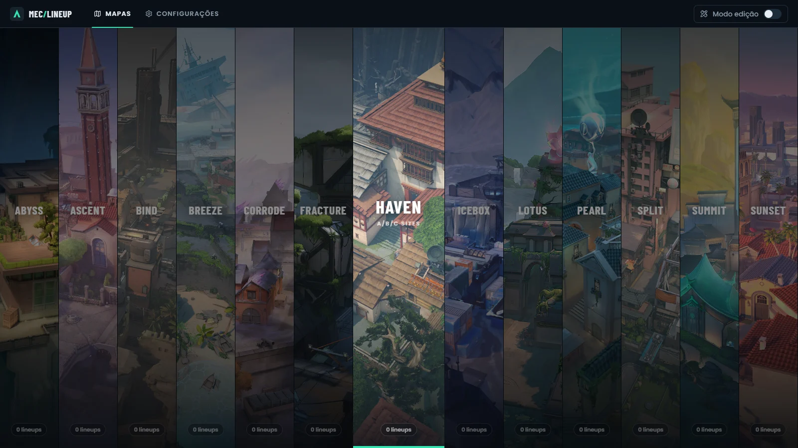
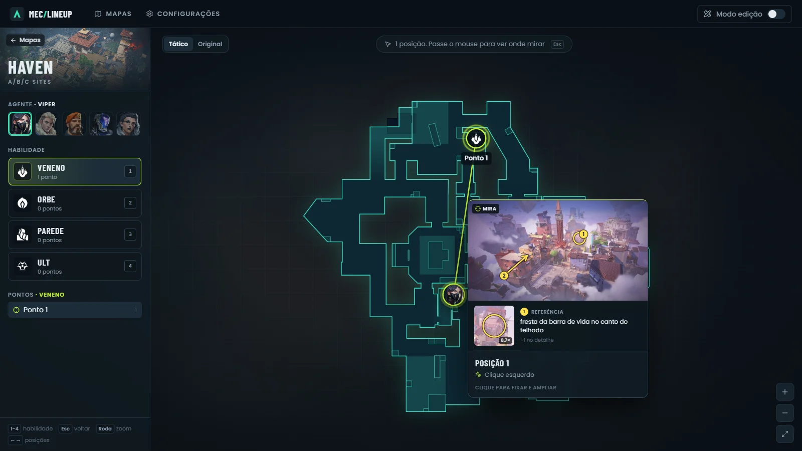
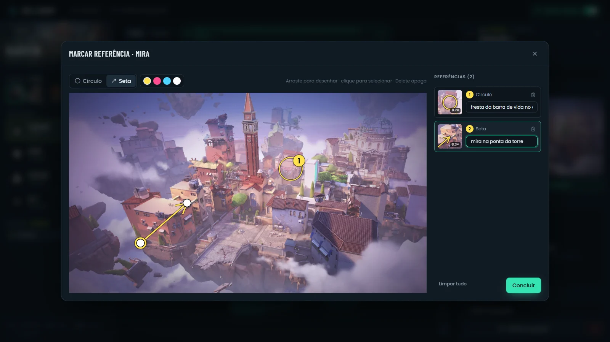
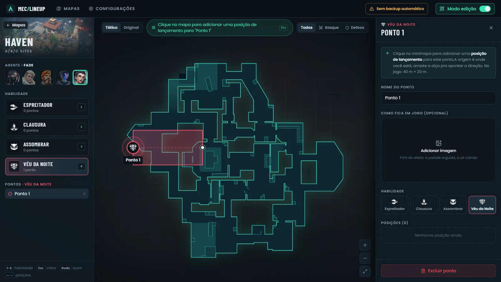

# MEC Lineup

App pessoal pra consultar **lineups de Valorant** no meio da partida: escolhe o
mapa, o agente e a habilidade, clica no ponto onde ela deve cair e vê de onde
lançar, com o print de onde mirar e o detalhe exato de referência ampliado.
Feito pra ficar aberto no segundo monitor (ou no alt-tab), sem login e sem
servidor na nuvem.



## O que ele faz

- **Menu de mapas** em colunas verticais, com a arte de cada mapa (vinda da
  [valorant-api.com](https://valorant-api.com)). Dá pra adicionar, editar,
  reordenar e excluir mapas.
- **Minimapa tático** com zoom e arraste. Cada habilidade tem pontos onde ela
  cai, e cada ponto tem as **posições de lançamento** (o retrato do agente no
  mapa, ligado ao ponto por uma linha).
- **Três prints por posição**: o **pixel** (onde mirar, obrigatório), **onde
  eu fico** (quando precisa estar num ponto exato) e **onde cai** (onde a
  habilidade caiu no mapa). Posição sem o pixel ganha um alerta no modo edição.
- **Preview no hover**: passar o mouse numa posição mostra o pixel, os outros
  dois prints, como lançar (clique, pulo + clique...) e o lado. Clicando, fica
  fixo num painel maior, com ← → pra trocar de posição.
- **Ponto de referência marcado no print**: círculo ou seta com uma nota
  ("fresta da barra de vida no tijolo"), e uma **lupa automática** que amplia
  esse detalhe, porque num preview pequeno ele some.
- **Habilidades no tamanho real do jogo**: ponto com zona de efeito, linha
  (parede da Viper, ult do Sova), área (ults da Viper, do Brimstone, do KAY/O)
  e faixa (ult da Fade), desenhadas na escala de cada mapa. O que é fixo no jogo
  fica travado: o feixe do Sova sempre tem 66 m e só gira.
- **Filtro de ataque/defesa**, lembrado entre mapas.
- **Agentes**: Viper, Sova, Brimstone, KAY/O e Fade já vêm prontos, com os
  ícones oficiais; qualquer outro agente pode ser adicionado, e ícones, nomes,
  cores, formas e medidas são editáveis.
- **Backup automático** na pasta `backups/` do projeto, com cópia diária.

| Preview no hover | Marcando a referência |
|---|---|
|  |  |



## Como usar

Com o app rodando (ver abaixo), abra **http://localhost:5180**.

**Consultar:** escolha o mapa → o agente → a habilidade (teclas **1 a 4**) →
clique no ponto → passe o mouse nas posições.

**Cadastrar:** ligue o **Modo edição** (canto superior direito).

1. Clique no minimapa pra marcar onde a habilidade cai (ou a origem da
   parede/ult). Arraste o ícone e as alças brancas pra ajustar.
2. Com o ponto selecionado, cada clique no mapa cria uma posição de lançamento.
3. No painel da posição, cole o **print do pixel**: **Win+Shift+S** no jogo e
   **Ctrl+V** com o mouse em cima do campo. O editor de marcação abre sozinho
   pra você circular a referência. Se quiser, cole também **onde você fica** e
   **onde a habilidade cai**.

| Atalho | Ação |
|---|---|
| `1`–`4` | troca a habilidade |
| `Esc` | volta um nível (fecha a posição, depois o ponto) |
| `←` `→` | posição anterior/próxima |
| roda do mouse, `+` `-` `0` | zoom / mapa inteiro |

## Rodando

Precisa de [Node.js](https://nodejs.org/) (testado no 24) e de Edge ou Chrome.

```bash
npm install
npm run atualizar         # compila e sobe o app em segundo plano
npm run autostart:ligar   # faz ele subir sozinho junto com o Windows
```

Depois disso não precisa rodar mais nada: o app fica **sempre ligado** em
`http://localhost:5180`, sem janela de terminal (log em `logs/servidor.log`).

| Comando | Pra quê |
|---|---|
| `npm run atualizar` | depois de mudar o código: recompila e reinicia o app |
| `npm run autostart:ligar` / `autostart:desligar` | liga/desliga a inicialização com o Windows (atalho na pasta Inicializar, sem admin) |
| `npm run dev` | desenvolvimento, na porta **5181** (ver abaixo) |
| `npm test` | testes (Vitest) |

## Dados e backup

Não tem banco na nuvem: **tudo fica no navegador** (IndexedDB), prints
incluídos, convertidos pra WebP pra ocupar menos espaço.

O IndexedDB é separado por endereço (host + porta), por isso a porta é fixa:
se o app abrisse em outra porta, apareceria vazio. Pelo mesmo motivo, **não
use janela anônima/InPrivate**: os dados somem ao fechar.

**Backup automático:** o servidor local grava em `backups/` alguns segundos
depois de cada alteração:

```
backups/
├── mec-lineup-backup.json      # sempre o mais recente
└── mec-lineup-AAAA-MM-DD.json  # uma cópia por dia, últimos 14 dias
```

A cópia diária existe porque o arquivo principal acompanha tudo, inclusive
algo apagado sem querer; a de ontem continua lá. Se você limpar os dados do
navegador, ao abrir o app ele encontra o backup e **pergunta se quer
restaurar**, sem gravar nada por cima antes.

Em **Configurações → Dados** dá pra trocar o destino por outra pasta (uma
pasta do OneDrive/Drive vira cópia na nuvem), salvar na hora, e exportar ou
importar um backup manualmente (é assim que se volta a um dia específico).

`backups/` fica fora do git: são seus dados e prints, e podem ficar grandes.

## Desenvolvimento

```bash
npm run dev   # http://localhost:5181
```

O modo de desenvolvimento usa a porta **5181**, com dados próprios no
navegador e backup em `backups-dev/`. Assim, testar coisas nunca encosta nos
dados reais do app de uso (porta 5180). Quando terminar, `npm run atualizar`
publica a mudança no app de uso.

**Stack:** Vite + React 19 + TypeScript + Tailwind CSS v4 + Motion, Dexie
(IndexedDB), React Router, Vitest.

```
src/
├── app/          # layout, rotas, modo edição
├── db/           # tipos, schema do Dexie (com migrações), repositórios, seed
├── features/
│   ├── maps/     # menu de mapas
│   ├── lineups/  # minimapa, marcadores, formas, painéis, editor de marcações
│   └── settings/ # agentes/habilidades, aparência, dados e backup
├── lib/          # lógica pura: geometria, formas, marcações, filtro, backup
└── ui/           # componentes base (botão, modal, imagem, lupa...)
backupServer.ts   # plugin do Vite que grava o backup em backups/
scripts/          # inicialização em segundo plano no Windows
```

### Decisões que valem saber

- **Coordenadas normalizadas (0 a 1)** da imagem do minimapa, independentes
  do zoom e do tamanho da tela. A rotação do minimapa é por mapa e só gira a
  imagem; os marcadores são reposicionados, então nunca aparecem de lado.
- **Tamanho real das habilidades:** as medidas em metros vêm da
  [wiki oficial](https://wiki.playvalorant.com) e são convertidas pra minimapa
  pela escala de cada mapa (`xMultiplier` da valorant-api × 100). Ficam
  editáveis em Configurações, pra acompanhar patches.
- **Marcações vetoriais:** círculos e setas são dados à parte do print, não
  desenhados na imagem. Ficam nítidos em qualquer tamanho e dá pra editar
  depois; a lupa é só um recorte da mesma imagem.
- **Cache de imagens remotas:** as capas dos mapas vêm como PNG de 3 MB. São
  baixadas uma vez, reduzidas pra WebP e guardadas no IndexedDB.
- **Backup pelo servidor local:** o navegador não grava numa pasta fixa sem o
  usuário escolher, e essa permissão expira. O servidor do Vite pode. A rota
  exige um cabeçalho próprio, o que força o preflight de CORS: outro site
  aberto no navegador não consegue sobrescrever o backup.
- **Migrações do banco** (Dexie, hoje na v7) nunca perdem dados: cada versão
  converte o que já existe, e backups antigos importados passam pela mesma
  conversão. Tudo isso tem teste.

## Créditos

Mapas, agentes e ícones vêm da [valorant-api.com](https://valorant-api.com);
medidas das habilidades, da [wiki oficial do Valorant](https://wiki.playvalorant.com).
Projeto pessoal, sem relação com a Riot Games. Valorant e todos os recursos
relacionados são propriedade da Riot Games.
